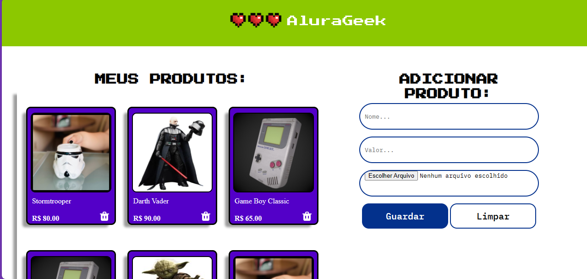

    <h1>Challenge AluraGeek</h1>

## Este é o repositório base do nosso projeto, nele voce encontrará uma página  HTML simples, um arquivo CSS e um Javascript

- Onde você pode  ver o projeto: [aqui](https://www.figma.com/file/1zm3NNIw4KcI0RQtR6UmqK/New-AluraGeek---PT?type=design&node-id=0-1&mode=design&t=FMgFotfL0V2NCfh1-0)

## Sobre o desafio:

- Desenvolvimento:

  

    

  

    
    
      
    

  

    
    

 

